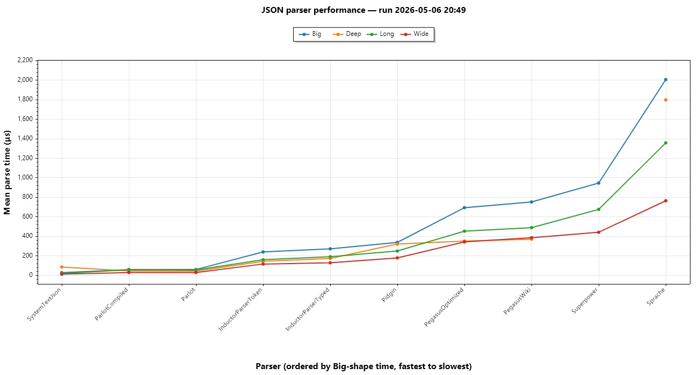

The Inductor Parser (IP) is a loose port of the [Inductor C++ Parser](https://github.com/EricZinda/InductorParser), designed for C#. I ported this while creating a new porject in Unity and during a period where I've been subjected to reviewing way too many Claude generated Regex's. My goal is to design a parser library that is:

- **More Readable than Regex:** The grammars are self-describing and human readable so they can be reasoned about, code reviewed and understood without looking up obscure letters and symbols. 
- **Designed for World Languages:** From the lexer, to the built-in rules, to normalization, it's designed around Unicode so grammars have a good starting point for world-language text (but it's not in your face if you don't care).
- **Safer Against Pathological Input:** It's designed to avoid "catastrophic backtracking" and pitfalls like it that can hang your app or blow your stack, by default.
- **Able to run on WebGL and .NET Standard 2.1 (and later) using IL2CPP**: It doesn't use Reflection.Emit or threads so that it can run in Unity targeting WebGL or IL2CPP on iPhone.
- **Fast enough to be used in production**: It is competitive against other .Net Parsers and fast enough to be used as a regex replacement for most uses.

If you just want to learn how to use it, follow the primers:

- [Primer 1: Getting Started](docs/primer1.md)
- [Primer 2: Walking the Tree](docs/primer2.md)
- [Primer 3: Unicode in the Inductor Parser](docs/Primer3.md)
- [Primer 4: Security-Related Concerns](docs/Primer4.md)
- [Tutorial: Peek](docs/tutorial-peek.md)

For more background, read on.

## More Readable than Regex

A major goal in building this parser is to replace hieroglyphic Regex patterns or complicated, hard to debug parsing code with something more readable, debuggable and understandable. Especially as I'm doing more and more reviewing of code written by LLMs, I've found it invaluable to have the LLM write pattern matching and parsing code in a form that I can actually review for correctness. 

Compare a couple top Regex questions from StackOverflow:

Match numbers only (From https://stackoverflow.com/q/273141)

```Re
Regex: ^\d+$
```
```CSharp
Inductor Parser:

var numbersOnly = AllOf(
    OneOrMore(OneOf(TokenSet.Digits)),
    Eof()
);

```

Match a line that doesn't contain the word "hede" (From https://stackoverflow.com/q/406230): 

```re
Regex: ^((?!hede).)*$
```
```csharp
Inductor Parser (actually matches all end of line variants which the OP probably really wanted):

var lineWithoutHede = AllOf(
    ZeroOrMore(AllOf(
        Not(Literal("hede")),
        Not(EndOfLine()),
        AnyToken()
    )),
    EndOfLine(eofIsEol: true)
);
```


[Primer 1: Getting Started](docs/primer1.md) walks through how to build rules in more detail.

## Designed for World Languages
If you write grammars using the Inductor Parser, you get a foundation that supports Unicode from the start:

- Each token presented to a rule is a user-perceived character (a ["Grapheme Cluster"](https://www.unicode.org/reports/tr29/#Grapheme_Cluster_Boundaries) in Unicode) which keeps grammars from matching partial non-ASCII characters or emoji sequences accidentally and allows writing rules more naturally.
- Built-in rules use Unicode-aware definitions for things like "whitespace" and "identifiers" so you don't miss corner cases.
- The parser defaults to normalizing both the input and your rules to the same form (which you can choose) so that you can write rules how you want and they will match the different forms automatically.
- Characters that can't possibly match the normalized form throw at compile time. They won't silently be ignored.
- Every Symbol in the parse tree (and every error on the result) exposes its source position in four units: char index, token index, line, and column. Symbols give you a start/end pair via SourceRange; errors give you the single failure point.

You can pretend you never heard the word "grapheme cluster" and write rules naturally: the guardrails are there by default and give you the right base to start from.

Here's a grammar for reading a simple setting that only accepts strings:

```CSharp
// Parse: Key = StringValue (e.g. Goo = 'some string')
var settingName = Identifier().As("name");

var quotedString = AllOf(
    Token("'"),
    ScanUntil(Token("'")),
    Token("'"))
    .As("value");

var document = AllOf(
    settingName,
    Optional(AnyWhitespace()),
    Token('='),
    Optional(AnyWhitespace()),
    quotedString
);
```

... and some examples that show how it handles different Unicode challenges well even if you weren't thinking about Unicode when you wrote it:

```CSharp
// Easy default case
var result = document.Parse("setting = '5'"); // name: "setting", value: "5"

// Identifier() follows official Unicode UAX #31 identifier rules, so names from many scripts work
document.Parse("Γειά = '5'");    // name: "Γειά",    value: "5"
document.Parse("привет = '1'");  // name: "привет",  value: "1"
document.Parse("你好 = '1'");    // name: "你好",     value: "1"

// é written as e + U+0301 (accent mark) is two C# chars that
// form one user-perceived grapheme. The parser accepts it
document.Parse("café = '5'");    // (é = e + U+0301) name: "café", value: "5"

// In a Devanagari language example, each grapheme is a consonant
// joined to a virama or vowel sign, sometimes many C# chars long
document.Parse("नमस्ते = '1'"); // name: "नमस्ते", value: "1"

// 𠮷 is U+20BB7, one rune but two C# chars. 
document.Parse("𠮷田 = '5'"); // name: "𠮷田", value: "5"

// Optional(AnyWhitespace()) matches Unicode's White_Space property (UAX #44), not just ASCII
document.Parse("setting\u00A0=\u00A0'5'");  // (non-breaking space)
document.Parse("setting\u3000=\u3000'5'");  // (ideographic space) name: "setting", value: "5"

// String values can hold anything except the closing quote. 
// Mixed scripts, emoji, and multi-rune graphemes all pass through untouched
document.Parse("motto = '你好 🎉 नमस्ते'"); // name: "motto", value: "你好 🎉 नमस्ते"
document.Parse("motto = '👨\u200D👩\u200D👧'");  // (ZWJ family emoji) name: "motto", value: "👨‍👩‍👧"
document.Parse("motto = '🇺🇸'");  // (regional-indicator flag) name: "motto", value: "🇺🇸"

// Emoji aren't in the UAX #31 identifier set, so the parser rejects them 
// the same way Python and Rust do:
document.Parse("setting🎉 = '5'"); // GrammarMismatch at char 7
```
Error positions are also designed for Unicode and reported in multiple units. When the input contains multi-C#-char letters, the char index and the token index are different. When it contains multi-rune tokens, they can be different by even more. This gives you the right tools for different jobs:

```CSharp
var result = document.Parse("𠮷田 = ");
// ErrorCharIndex=6, ErrorTokenIndex=5
// (each supplementary letter is two chars but one token)

var result = document.Parse("नमस्ते = ");
// ErrorCharIndex=9, ErrorTokenIndex=7
// (2 of the name's 4 letters take 2 chars each)
```

The same multi-unit positioning is available for every Symbol in the parse tree on success. Every Symbol carries a `SourceRange` that exposes the same four fields (`CharIndex`, `TokenIndex`, `Line`, `Column`) for both `Start` and `End`:

```CSharp
var result = document.Parse("motto = '👨‍👩‍👧'");
var range = result.Tree!.Find(quotedString)!.SourceRange!.Value;
// Width of the matched value:
//   range.End.CharIndex  - range.Start.CharIndex  == 10  // 8 for the family + 2 quotes
//   range.End.TokenIndex - range.Start.TokenIndex ==  3  // 1 for the family + 2 quotes
```

Use whichever unit matches what your consumer counts in. Chars for `string.Substring` or an editor diagnostic. Tokens for a `^^^` underline a human will look at and recognize as covering one thing.

[Primer 3: Unicode in the Inductor Parser](docs/Primer3.md) walks through how Unicode works in rules in more detail.

## Safer Against Pathological Input

Regex expressions can sometimes introduce [denial-of-service attacks](https://en.wikipedia.org/wiki/ReDoS) (or just plain poor user experiences) when they encounter adversarial or unexpected text. Here's a classic that looks reasonable in code review: 

`^([a-zA-Z0-9]+)*@example.com$`

A simple email-ish validator. Feed it `"aaaaaaaaaaaaaaaaaaaaa!"` and .NET Regex will happily burn seconds trying to find a match. The problem is the nested `+` inside `*`: when the match fails, the engine has to try every way to split the a's across the two quantifiers before giving up. Add another a or two and the time doubles.

The Inductor Parser avoids this and is more readable as well:

```csharp
var validator = AllOf(
    OneOrMore(OneOf(TokenSet.Ascii.Letters | TokenSet.Ascii.Digits)),
    Literal("@example.com"),
    Eof()
);
```

`OneOrMore` greedily consumes all the a's in one pass, sees the `!`, fails cleanly. It takes linear time no matter what you throw at it.

Backtracking isn't the only way to hang. A 100 MB input file, a grammar that recurses 10,000 levels deep on nested parenthesis, or untrusted input in a web handler can all do it, too. The parser has three ways to handle these scenarios:

- `RuleCountLimit` (default 10M) caps how many rule invocations a parse can do.
- `MaxDepth` (default 1000) caps the recursion depth. 
- `Timeout` (default off) caps wall-clock time spent (done without a thread to support WebGL).

See [Primer 4: Security-Related Concerns](docs/Primer4.md) for more details on security related features and how the parser is designed to combat them.


## Able to run on WebGL and .NET Standard 2.1 (and later) using IL2CPP 
Inductor Parser is designed to be able to be used in Unity, targeting WebGL and iPhone, which constrains it:
- WebGL is single-threaded, so no background timers
- IL2CPP means no IL can be generated at runtime: No System.Reflection.Emit, no LINQ Expression.Compile, no source generators producing IL at parse time
- .NET Standard 2.1, not .NET 5+ since Unity's IL2CPP surface is still netstandard2.1. (works fine on .NET 5+, though!)

## Fast Enough to be Used in Production
To evaluate performance I used open source benchmarks built by others so that I wasn't unfairly building tests that IP was good at. You can run them yourself in the src/Benchmarks folder.

The [Parlot](https://github.com/sebastienros/parlot) project had a great benchmark of C# parser libraries that I forked into the src/Benchmarks folder. I added both InductorParser and Pegasus (another PEG-style parser) to the suite. You can read the details of the test, what I changed, etc [here](src/Benchmarks/README.md). It asks each parser library to build a Json parser and read 4 different documents that are different shapes. Real world and a nice benchmark. In addition to performance, it's illustrative to look a the grammars for each parser library and compare for readability and reviewability, they're [here](src/Benchmarks/Json).

### Latest results
[](src/Benchmarks/performance-chart.jpg)

Both the JPG above and the interactive [HTML version](src/Benchmarks/performance-chart.html) are regenerated automatically every benchmark run, with the run date stamped in the chart title so you can tell at a glance how fresh the numbers are. The full table with allocations and ratios is in [src/Benchmarks/README.md](src/Benchmarks/README.md).

