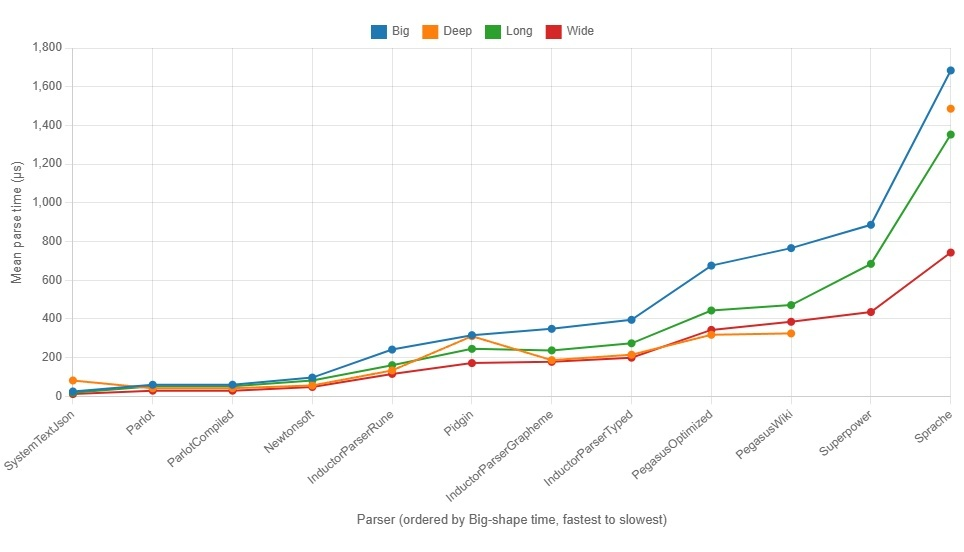

The Inductor Parser (IP) is a loose port of the [Inductor C++ Parser](https://github.com/EricZinda/InductorParser), designed for C#. I ported this as part of a Unity editor project, and during a period where I've been subjected to way too many Claude generated Regex's I had to review. My goal is to design a parser library that is:

- **Designed for World Languages:** From the default lexer, to the built-in rules, to normalization, it's designed around Unicode so grammars have a good starting point for world-language text.
- **More Readable than Regex:** The grammars are self-describing and human readable so they can be reasoned about, code reviewed and understood without looking up obscure letters and symbols. 
- **Safer Against Pathological Input:** It's designed to avoid "catastrophic backtracking" and pitfalls like it that can hang your app, blow your stack, etc.
- **Able to run on WebGL and .NET Standard 2.1 (and later) using IL2CPP** and doesn't use Reflection.Emit or threads so that it can run in Unity targeting WebGL or IL2CPP on iPhone
- **Fast enough to be used in production**

If you just want to learn how to use it, follow the primers:

- [Primer 1: Getting Started](docs/primer1.md)
- [Primer 2: Walking the Tree](docs/primer2.md)
- [Tutorial: Peek](docs/tutorial-peek.md)

## Designed for World Languages
If you write grammars in Inductor Parser, you get a foundation that helps you support Unicode from the start:

- By default, each token presented to a rule is a .NET `StringInfo` text element, which follows Unicode grapheme-cluster behavior on modern .NET and keeps ordinary grammars from breaking apart non-ASCII text or emoji sequences accidentally.
- Built-in rules use Unicode-aware definitions for things like "whitespace" and "identifiers" so you don't miss common corner cases.
- The parser defaults to normalizing input so that characters that can be written as multiple things in Unicode get normalized to one (and the error indexes reverse this so errors point to the right place in the original text)
- Every Symbol in the parse tree carries a `SourceRange` that reports its span in chars, runes, and graphemes plus line and column, so error highlights and IDE tooltips can pick the unit that matches what they show

You can also pretend you never heard the word "Grapheme Cluster" and write rules naturally: it will still give you the right base to start from!

Here's a grammar for reading a simple setting, and examples that show how it handles classic Unicode edge cases.

```CSharp
// Parse: Key = Value (e.g. Foo=5, Bar = 1.05, Goo = "some string")
var settingName = Identifier().As("name");

// "Rune" is the .NET term for Unicode code point
var quotedString = AllOf(
    Grapheme('"'),
    ScanUntil(stopAt=RuneSet.Runes("\"")),
    Grapheme('"'));

var settingValue = FirstOf(
    Float(),
    Integer(),
    quotedString
).Flatten(FlattenType.Preserve).As("value");

var document = AllOf(
    settingName,
    OptionalWhitespace(),
    Grapheme('='),
    OptionalWhitespace(),
    settingValue
);

// Easy default case
var result = document.Parse("setting = 5"); // name: "setting", value: "5"

// Identifier() follows UAX #31 identifier rules, so names from many scripts work
document.Parse("Γειά = 5");    // name: "Γειά",    value: "5"
document.Parse("привет = 1");  // name: "привет",  value: "1"
document.Parse("你好 = 1");    // name: "你好",     value: "1"

// é written as e + U+0301 (accent mark) is two runes that
// form one user-perceived character. The parser accepts it
document.Parse("café = 5");    // (é = e + U+0301) name: "café", value: "5"

// In a Devanagari language example, each grapheme is a consonant
// joined to a virama or vowel sign, sometimes three or four runes long
document.Parse("नमस्ते = 1"); // name: "नमस्ते", value: "1"

// 𠮷 is U+20BB7, one rune but two UTF-16 chars. 
document.Parse("𠮷田 = 5"); // name: "𠮷田", value: "5"

// OptionalWhitespace() matches Unicode's White_Space property (UAX #44), not just ASCII
document.Parse("setting\u00A0=\u00A05");  // (non-breaking space)
document.Parse("setting\u3000=\u30005");  // (ideographic space) name: "setting", value: "5"

// String values can hold anything except the closing quote. 
// Mixed scripts, emoji, and multi-rune graphemes all pass through untouched
document.Parse("motto = \"你好 🎉 नमस्ते\""); // name: "motto", value: "你好 🎉 नमस्ते"
document.Parse("motto = \"👨\u200D👩\u200D👧\"");  // (ZWJ family emoji) name: "motto", value: "👨‍👩‍👧"
document.Parse("motto = \"🇺🇸\"");  // (regional-indicator flag) name: "motto", value: "🇺🇸"

// Emoji aren't in the UAX #31 identifier set, so the parser rejects them 
// the same way Python and Rust do:
document.Parse("setting🎉 = 5"); // GrammarMismatch at char 7
```
Error positions are also designed for Unicode and reported in multiple units. When the input contains supplementary-plane letters, char index and rune index are different. When it contains multi-rune graphemes, rune index and grapheme index are different. This gives you the right tools for different jobs:

```CSharp
var result = document.Parse("𠮷田 = ");
// ErrorCharIndex=6, ErrorRuneIndex=5, ErrorGraphemeIndex=5
// (each supplementary letter is two chars but one rune)

var result = document.Parse("नमस्ते = ");
// ErrorCharIndex=9, ErrorRuneIndex=9, ErrorGraphemeIndex=7
// (Devanagari is BMP, so chars == runes, but four of the name's
//  six graphemes span two or three runes each)
```

The same multi-unit positioning is available for every Symbol in the parse tree on success. Every Symbol carries a `SourceRange` that exposes the same five fields (`CharIndex`, `RuneIndex`, `GraphemeIndex`, `Line`, `Column`) for both `Start` and `End`:

```CSharp
var result = document.Parse("motto = \"👨‍👩‍👧\"");
var range = result.Tree!.Find(settingValue)!.SourceRange!.Value;
// Width of the matched value:
//   range.End.CharIndex     - range.Start.CharIndex     == 10  // 8 for the family + 2 quotes
//   range.End.RuneIndex     - range.Start.RuneIndex     ==  7  // 5 for the family + 2 quotes
//   range.End.GraphemeIndex - range.Start.GraphemeIndex ==  3  // 1 for the family + 2 quotes
```

Use whichever unit matches what your consumer counts in. Chars for `string.Substring` or an editor diagnostic. Graphemes for a `^^^` underline a human will look at and recognize as covering one thing.

## More Readable than Regex

A major goal in building this parser is to be able to replace hieroglyphic Regex patterns or complicated, hard to debug parsing code with something more readable, debuggable and understandable. Especially as I'm doing more and more reviewing of code written by LLMs, I've found it invaluable to have the LLM write pattern matching and parsing code in a form that I can actually review for correctness. 

Compare a couple top Regex questions from StackOverflow:

Match numbers only (From https://stackoverflow.com/q/273141)

```Re
Regex: ^\d+$
```
```CSharp
Inductor Parser:

var numbersOnly = AllOf(
    OneOrMore(OneOf(RuneSet.Digits)),
    Eof()
);

```

Match a line that doesn't contain the word "hede" (From https://stackoverflow.com/q/406230): 

```re
Regex: ^((?!hede).)*$
```
```csharp
Inductor Parser (actually matches all end of line variants which the OP probably really wanted):

var lineWithoutHede = AllOf(
    ZeroOrMore(AllOf(
        Not(Literal("hede")),
        Not(EndOfLine()),
        AnyToken()
    )),
    EndOfLineOrEof()
);
```

## Safer Against Pathological Input

Regex expressions can sometimes introduce [denial-of-service attacks](https://en.wikipedia.org/wiki/ReDoS) (or just plain poor user experiences) when they encounter adversarial or unexpected text. Here's a classic that looks reasonable in code review: `^([a-zA-Z0-9]+)*@example.com$`. A simple email-ish validator. Feed it `"aaaaaaaaaaaaaaaaaaaaa!"` and .NET Regex will happily burn seconds trying to find a match. The problem is the nested `+` inside `*`: when the match fails, the engine has to try every way to split the a's across the two quantifiers before giving up. Add another a or two and the time doubles.

The Inductor Parser avoids this and is more readable as well:

```csharp
var validator = AllOf(
    OneOrMore(OneOf(RuneSet.Ascii.Letters | RuneSet.Ascii.Digits)),
    Literal("@example.com"),
    Eof()
);
```

`OneOrMore` greedily consumes all the a's in one pass, sees the `!`, fails cleanly. It takes linear time no matter what you throw at it.

Even the textbook ReDos example `^(a+)+$` is safe in IP:

```csharp
var pattern = AllOf(OneOrMore(OneOrMore(Grapheme('a'))), Eof());
```

Even written in this contrived shape with one composite rule wrapping another, it still runs in linear time. 

Backtracking isn't the only way to hang. A 100 MB input file, a grammar that recurses 10,000 levels deep on nested parenthesis, or untrusted input in a web handler can all do it, too. IP has three ways to handle these scenarios:

- `RuleCountLimit` (default 10M) caps how many rule invocations a parse can do. The benchmark's JSON parser on a 1 MB input (1,081,666 chars) does about 1.4M invocations and parses in ~55 ms, so the default has comfortable headroom for well-formed input. Deterministic across hardware, so the same input trips at the same count on every machine.
- `MaxDepth` (default 1000) caps the recursion depth. 10,000 nested open parenthesis fail cleanly instead of killing the process with an uncatchable `StackOverflowException`.
- `Timeout` (default off) caps wall-clock time spent (done without a thread to support WebGL). Off by default because the other two handle safety issues and wall-clock limits make tests flaky across hardware. Still worth turning on for untrusted input in a request handler.

## Able to run on WebGL and .NET Standard 2.1 (and later) using IL2CPP 
Inductor Parser is designed to be able to be used in Unity, targeting WebGL and iPhone, which constrains it:
- WebGL is single-threaded, so no background timers
- IL2CPP means no IL can be generated at runtime: No System.Reflection.Emit, no LINQ Expression.Compile, no source generators producing IL at parse time
- .NET Standard 2.1, not .NET 5+ since Unity's IL2CPP surface is still netstandard2.1. (works fine on .NET 5+, though!)

## Fast Enough to be Used in Production
To evaluate performance I used open source benchmarks built by others so that I wasn't unfairly building tests that IP was good at. You can run them yourself in the src/Benchmarks folder.

The [Parlot](https://github.com/sebastienros/parlot) project had a great benchmark of C# parser libraries that I forked into the src/Benchmarks folder. I added both InductorParser and Pegasus (another PEG-style parser) to the suite. You can read the details of the test, what I changed, etc [here](src/Benchmarks/README.md). It asks each parser library to build a Json parser and read 4 different documents that are different shapes. Real world and a nice benchmark. In addition to performance, it's illustrative to look a the grammars for each parser library and compare for readability and reviewability, they're [here](src/Benchmarks/Json).

### Results from 04/24/2026
[](src/Benchmarks/Benchmark04242026.jpg)

